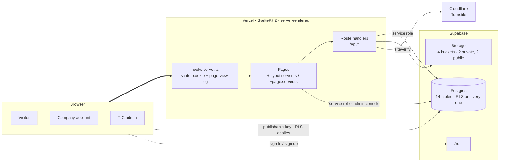
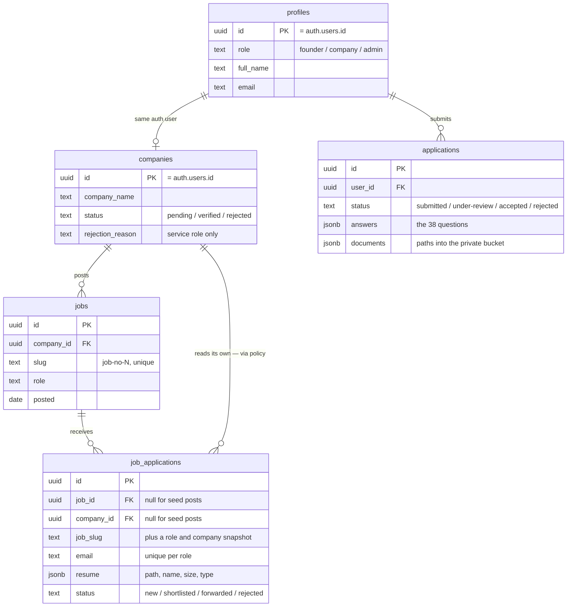
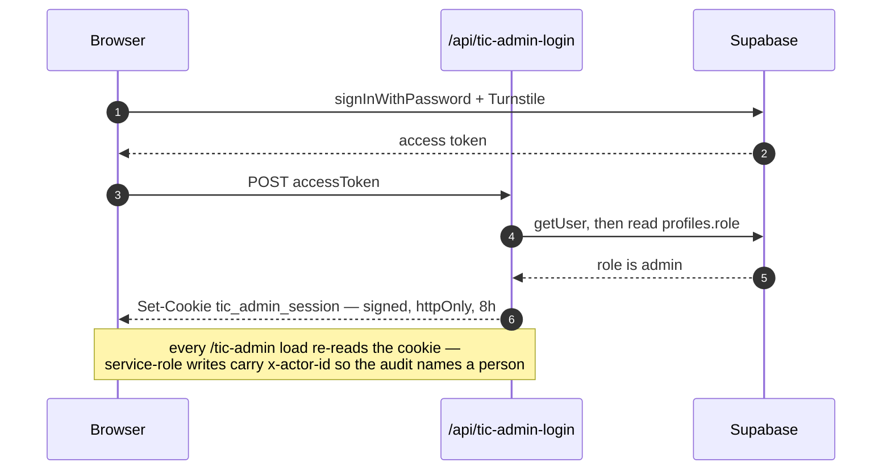
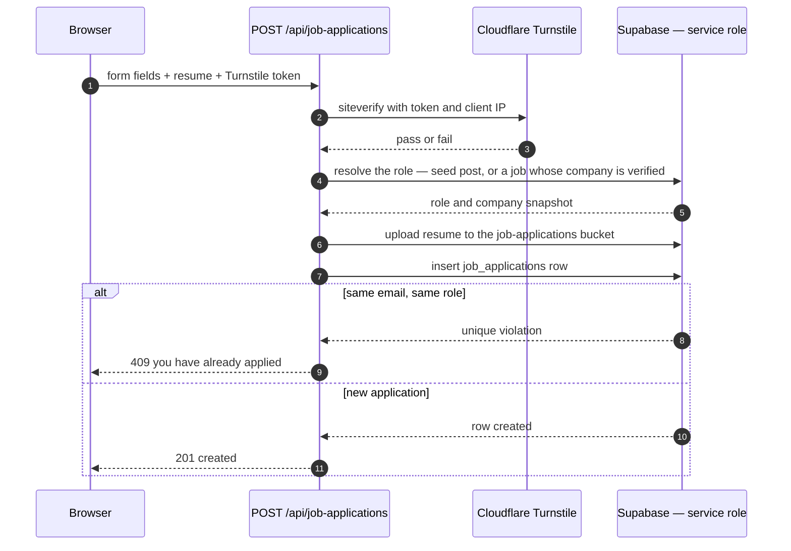
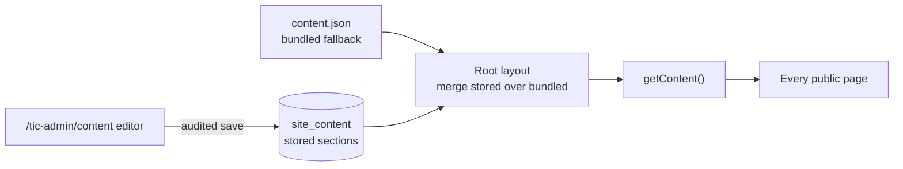

<div align="center">

<picture>
  <source media="(prefers-color-scheme: dark)" srcset="src/lib/assets/logo.webp">
  
</picture>

<h1>IIT Guwahati Technology Incubation Centre</h1>

<p><strong>Incubation, mentorship, infrastructure and funding support for deep-tech startups.</strong><br>
The public website, the company job portal, the incubation application, and the internal admin console — one SvelteKit app.</p>

<p>
  
  
  
  
  
  
  
</p>

<p>
  <a href="https://iitgtic.itsjeu.com"><b>Live site</b></a> ·
  <a href="#routes"><b>All page links</b></a> ·
  <a href="https://iitgtic.itsjeu.com/status">Project status</a> ·
  <a href="https://iitgtic.itsjeu.com/opportunities">Opportunities</a> ·
  <a href="https://iitgtic.itsjeu.com/founder/application">Apply for incubation</a>
</p>

<p>
  <a href="https://iitgtic.itsjeu.com/login"><b>Sign in</b></a> — one door, for everyone ·
  <a href="https://iitgtic.itsjeu.com/founder">Founder console</a> ·
  <a href="https://iitgtic.itsjeu.com/tic-admin">TIC admin console</a>
</p>

</div>

---

## Contents

| Section                                                                                                                                                                           | What you will find                           |
| --------------------------------------------------------------------------------------------------------------------------------------------------------------------------------- | -------------------------------------------- |
| [Overview](#overview) · [Stack](#stack) · [Architecture](#architecture)                                                                                                           | What the app is and how it fits together     |
| [Getting started](#getting-started) · [Environment](#environment) · [Scripts](#scripts)                                                                                           | Running it locally                           |
| [Project structure](#project-structure) · [Routes](#routes) · [API surface](#api-surface)                                                                                         | Finding your way around the code             |
| [Data model](#data-model) · [Permissions](#permissions-at-a-glance) · [Role applications](#role-applications)                                                                     | Postgres, RLS and the flows that write to it |
| [Operations](#operations) · [Transactional email](#transactional-email) · [Admin assistant](#admin-assistant) · [Content model](#content-model) · [SEO](#seo) · [Deploy](#deploy) | Running it in production                     |
| [Roadmap](#roadmap)                                                                                                                                                               | What is deliberately not built yet           |

---

## Overview

| Area                       | What it does                                                                                                                                                      | Lives at                                      |
| -------------------------- | ----------------------------------------------------------------------------------------------------------------------------------------------------------------- | --------------------------------------------- |
| **Public site**            | Editorial pages for the centre — about, team, mentors, governing body, FAQ, blog, incubation pillars, incubated startups, events, partners                        | `/`                                           |
| **Opportunities board**    | Roles at incubated startups, filterable by type; merges seed posts with live company postings                                                                     | `/opportunities`                              |
| **Role applications**      | Public apply form per role — resume upload, Turnstile-gated, no account needed                                                                                    | `/opportunities/[id]`                         |
| **Founder console**        | A founder registers the startups they run, applies for incubation, posts roles and adds a team — each thing approved by TIC before it is public                    | `/founder`                                    |
| **Incubation application** | Eight-step wizard, 38 questions, four document uploads; filled in per startup and autosaving a draft so a refresh does not lose progress                          | `/founder/application`                        |
| **TIC admin console**      | Companies, incubation applications, role applicants, posted jobs, users, activity, content                                                                        | `/tic-admin`                                  |
| **Content editing**        | Every public page's copy, edited from the console and versioned in the audit log                                                                                  | `/tic-admin/content`                          |
| **Media & storage**        | Upload an image for any page field from the content editor; a storage console shows every bucket's usage and refuses to delete a file still in use                | `/tic-admin/storage`                          |
| **Applicant inbox**        | A verified startup reads the applicants for roles it posted — contact details, answers, signed resume links, CSV export                                           | `/founder/applicants`                         |
| **Transactional email**    | Resend-backed mail with editable templates, a delivery log you can preview, usage against the plan allowance, and bounce/complaint feedback from a signed webhook | `/tic-admin/email`                            |
| **Analytics & audit**      | Page impressions with bot separation, plus a trigger-written audit trail                                                                                          | `/tic-admin/activity`                         |
| **Build status**           | Self-hosted checklist of every route, component and backend piece                                                                                                 | `/status`                                     |

## Stack

| Layer           | Choice                         | Notes                                                       |
| --------------- | ------------------------------ | ----------------------------------------------------------- |
| Framework       | **SvelteKit 2** + **Svelte 5** | Runes throughout; server-rendered by default                |
| Language        | **TypeScript**                 | `svelte-check` in `pnpm check`                              |
| Styling         | **Sass / SCSS**                | Shared variables and mixins in `src/lib/styles`             |
| Data            | **Supabase**                   | Postgres, Auth, Row Level Security, Storage                 |
| Bot defence     | **Cloudflare Turnstile**       | Secret key stays server-side; every gated write re-verifies |
| Motion          | **GSAP**                       | Page and section animations                                 |
| Icons           | **@lucide/svelte**             | One icon set                                                |
| Hosting         | **Vercel**                     | `@sveltejs/adapter-auto` + Vercel Analytics                 |
| Package manager | **pnpm**                       | `.npmrc` pinned; do not use npm here                        |

## Architecture



Three things follow from that shape:

- **The browser only ever holds the publishable key.** Anything it can read, RLS has already
  decided it may read. The service-role key exists solely inside `src/lib/server` and
  `+server.ts` files — SvelteKit fails the build if it is ever pulled into a client bundle.
- **Writes that RLS cannot express go through a route handler.** Verifying a company,
  moving an application through review, or accepting an application from someone with no
  account are all "there is no `auth.uid()` to check" problems, so they are server routes
  guarded by the admin session cookie or by Turnstile.
- **Nothing in the admin console waits on a client-side fetch.** Every section is loaded by
  `+page.server.ts`, so navigation never flashes an empty screen.

## Getting started

This project uses **pnpm**.

```sh
pnpm install
cp .env.example .env.local   # then fill in the values
pnpm dev
```

Open http://localhost:5173.

> [!TIP]
> `$env/static/*` is read once at startup — **restart the dev server after editing
> `.env.local`**, or you are still running the old values. `pnpm doctor` tells you whether
> the file can actually reach Supabase.

### Environment

Copy `.env.example` to `.env.local`. Everything without the `PUBLIC_` prefix is server-only
and must never reach the browser.

| Variable                                     | Scope           | What it is                                                                                                                                                                                                       |
| -------------------------------------------- | --------------- | ---------------------------------------------------------------------------------------------------------------------------------------------------------------------------------------------------------------- |
| `PUBLIC_SUPABASE_URL`                        | client + server | Supabase project URL                                                                                                                                                                                             |
| `PUBLIC_SUPABASE_PUBLISHABLE_KEY`            | client + server | Browser-safe key; RLS still applies to everything it does                                                                                                                                                        |
| `SUPABASE_SERVICE_ROLE_KEY`                  | **server only** | Bypasses RLS. Used by the admin routes and the public submit route                                                                                                                                               |
| `ADMIN_SESSION_SECRET`                       | **server only** | Signs the admin session cookie. Rotating it signs every admin out                                                                                                                                                |
| `TIC_ADMIN_PASSWORD`                         | **server only** | Bootstrap password; works only while no admin account exists                                                                                                                                                     |
| `IITG_SUPABASE_PASSWORD`                     | CLI only        | Postgres password for `supabase db push`; the app never reads it                                                                                                                                                 |
| `PUBLIC_TURNSTILE_SITE_KEY`                  | client          | Cloudflare Turnstile widget key                                                                                                                                                                                  |
| `TURNSTILE_SECRET_KEY`                       | **server only** | Verifies tokens against Cloudflare                                                                                                                                                                               |
| `RESEND_API_KEY`                             | **server only** | Sends transactional mail. Absent, nothing is delivered                                                                                                                                                           |
| `RESEND_FROM`                                | **server only** | From address; must be on a domain verified in Resend                                                                                                                                                             |
| `RESEND_REPLY_TO`                            | **server only** | Optional reply-to                                                                                                                                                                                                |
| `ADMIN_ALERT_EMAIL`                          | **server only** | Where the "admin signed in" and "new applicant signed up" alerts go. Falls back to `RESEND_REPLY_TO`, then the `RESEND_FROM` address. These alerts are **TIC operations**, not the developer — before handover, get a real TIC team inbox and set this to it                                                                                                     |
| `RESEND_PLAN`                                | **server only** | `free` / `pro` / `scale` / `enterprise` — what the usage meter counts against                                                                                                                                    |
| `RESEND_MONTHLY_LIMIT`, `RESEND_DAILY_LIMIT` | **server only** | Override the plan caps for a custom allowance                                                                                                                                                                    |
| `RESEND_WEBHOOK_SECRET`                      | **server only** | Signing secret for `/api/resend-webhook`. Without it the endpoint refuses every request, by design — an unsigned version would let anyone suppress any address                                                   |
| `PUBLIC_SITE_URL`                            | client + server | Absolute origin for links inside emails, which have no request to infer one from. Canonicals and social cards do **not** use it — they come from the request, so a preview deploy is right without configuration |
| `EMAIL_SITE_NAME`                            | **server only** | Name used in the email copy and the From display name                                                                                                                                                            |

Everything under `RESEND_*` is optional. Without `RESEND_API_KEY` the app still renders
every message and records it in the console as **blocked**, so nothing breaks — it simply
does not deliver.

Generate a session secret with:

```sh
node -e "console.log(require('crypto').randomBytes(32).toString('hex'))"
```

## Scripts

| Script                           | What it does                                                                     |
| -------------------------------- | -------------------------------------------------------------------------------- |
| `pnpm dev`                       | Start the dev server                                                             |
| `pnpm build`                     | Build for production                                                             |
| `pnpm preview`                   | Preview the production build locally                                             |
| `pnpm check`                     | Type-check with `svelte-check`                                                   |
| `pnpm lint`                      | Prettier + ESLint check                                                          |
| `pnpm format`                    | Format with Prettier                                                             |
| `pnpm doctor`                    | Check `.env.local` can reach Supabase and that all four storage buckets exist    |
| `pnpm backup`                    | Tables + storage to `./backups/` — see [Backups](#backups-and-the-restore-drill) |
| `pnpm restore <dir> --dry-run`   | Rehearse a restore; drop the flag to actually write                              |
| `node scripts/seed-content.js`   | Import `content.json` sections into `site_content`                               |
| `node scripts/demo-data.js seed` | Two applications + one pending company, for working on the admin screens         |

## Project structure

```
src/
├── app.html                # Document shell + global SEO meta
├── hooks.server.ts         # Visitor cookie + one page_views row per HTML GET
├── lib/
│   ├── assets/             # Bundled assets (imported into components)
│   ├── components/         # Reusable UI components
│   ├── data/
│   │   └── content.json    # Content for static pages + dynamic [slug] routes
│   ├── server/             # Service-role client, admin session + guard (never bundled)
│   └── utils/
├── routes/
│   ├── +layout.svelte
│   ├── +page.svelte        # Home
│   ├── about/              # About, team, mentors, blog, FAQ, governing body
│   ├── events/             # Events index + [slug] detail
│   ├── incubation/         # Incubation pillars + [slug] detail
│   ├── incubated-startups/ # Categories + [slug]/[startupSlug]
│   ├── opportunities/      # Job postings (seed + Supabase) + apply form
│   ├── partners/
│   ├── status/             # Public build checklist
│   ├── tic-admin/          # Admin dashboard (protected, noindex)
│   ├── api/                # Turnstile, admin login, public + service-role routes
│   └── sitemap.xml/        # Dynamic sitemap endpoint
└── styles/
supabase/
└── migrations/             # Schema + RLS, applied with `supabase db push`
static/
├── banner-iitgtic.webp     # Open Graph share image
├── favicon.svg
└── robots.txt
```

## Routes

Every page the app serves, with a link to it on the live site. Base URL is
`https://iitgtic.itsjeu.com` — swap it for `http://localhost:5173` when running locally.
Links marked 🔒 need a session; opening one signed-out redirects to the matching sign-in page.

<details open>
<summary><b>Public — landing and editorial</b></summary>

| Page                    | Link                                                                                                     | What it is                                                   |
| ----------------------- | -------------------------------------------------------------------------------------------------------- | ------------------------------------------------------------ |
| Home                    | [`/`](https://iitgtic.itsjeu.com/)                                                                       | Intro hero, association marquee, events-driven slider        |
| About                   | [`/about`](https://iitgtic.itsjeu.com/about)                                                             | The centre and what it does                                  |
| What happens here       | [`/about/what-happens`](https://iitgtic.itsjeu.com/about/what-happens)                                   | How incubation actually runs                                 |
| Governing body          | [`/about/governing-body`](https://iitgtic.itsjeu.com/about/governing-body)                               | Board members                                                |
| Committee of management | [`/about/committee-of-management`](https://iitgtic.itsjeu.com/about/committee-of-management)             | Management committee                                         |
| Team                    | [`/about/team`](https://iitgtic.itsjeu.com/about/team)                                                   | Staff                                                        |
| TIC coordinators        | [`/about/tic-coordinators`](https://iitgtic.itsjeu.com/about/tic-coordinators)                           | Departmental coordinators                                    |
| Mentors                 | [`/about/mentors`](https://iitgtic.itsjeu.com/about/mentors)                                             | Mentor network                                               |
| FAQ                     | [`/about/faq`](https://iitgtic.itsjeu.com/about/faq)                                                     | Common questions                                             |
| Blog                    | [`/about/blog`](https://iitgtic.itsjeu.com/about/blog) · `/about/blog/[slug]`                            | Writing from the centre, index and post                      |
| Programs                | [`/programs`](https://iitgtic.itsjeu.com/programs)                                                       | Programme overview                                           |
| Schemes                 | [`/schemes`](https://iitgtic.itsjeu.com/schemes)                                                         | Funding and support schemes                                  |
| Incubation pillars      | [`/incubation`](https://iitgtic.itsjeu.com/incubation) · `/incubation/[slug]`                            | Five support pillars, each with a scrollspy detail page      |
| Incubated startups      | [`/incubated-startups`](https://iitgtic.itsjeu.com/incubated-startups) · `/[slug]/[startupSlug]`         | Current, virtual and graduated cohorts, down to one startup  |
| Events                  | [`/events`](https://iitgtic.itsjeu.com/events) · `/events/[slug]`                                        | Upcoming and past events                                     |
| Partners                | [`/partners`](https://iitgtic.itsjeu.com/partners)                                                       | Partner grid                                                 |
| Contact                 | [`/contact`](https://iitgtic.itsjeu.com/contact)                                                         | Enquiry form and a click-to-load map                         |
| Project status          | [`/status`](https://iitgtic.itsjeu.com/status)                                                           | Build checklist — frontend and backend rails                 |
| Sitemap                 | [`/sitemap.xml`](https://iitgtic.itsjeu.com/sitemap.xml)                                                 | Generated from the route list plus content slugs             |

</details>

<details>
<summary><b>Opportunities and applying</b></summary>

| Page                    | Link                                                                                                     | What it is                                                        |
| ----------------------- | -------------------------------------------------------------------------------------------------------- | ----------------------------------------------------------------- |
| Opportunities board     | [`/opportunities`](https://iitgtic.itsjeu.com/opportunities)                                             | Every open role, filterable by type                               |
| Roles at TIC            | [`/opportunities/tic-jobs`](https://iitgtic.itsjeu.com/opportunities/tic-jobs)                            | The centre's own openings                                         |
| Roles at startups       | [`/opportunities/startup-jobs`](https://iitgtic.itsjeu.com/opportunities/startup-jobs)                    | Openings at incubated startups                                    |
| Role detail + apply     | `/opportunities/[id]`                                                                                    | One role, with the Turnstile-gated apply form — no account needed |
| Incubation application  | [`/founder/application`](https://iitgtic.itsjeu.com/founder/application)                                 | Eight-step wizard, 38 questions, four document uploads. Sign in first |

</details>

<details>
<summary><b>Accounts and auth</b></summary>

One sign-in for everyone, and two roles behind it: **admin** and **founder**. `/login`
authenticates with supabase-js, hands the token to `/api/session-login`, and the server reads
the account's role, issues the matching signed cookie and says which console to open.

| Page           | Link                                                                     | What it is                                                    |
| -------------- | ------------------------------------------------------------------------ | ------------------------------------------------------------- |
| **Sign in**    | [`/login`](https://iitgtic.itsjeu.com/login)                             | The one door — TIC team, founders, and their team members     |
| Sign up        | [`/apply`](https://iitgtic.itsjeu.com/apply)                             | Creates a founder account. Startups are registered inside it  |
| Auth callback  | [`/auth/callback`](https://iitgtic.itsjeu.com/auth/callback)             | Where every link in an auth email lands; forwards to `?next=` |
| Reset password | [`/auth/reset-password`](https://iitgtic.itsjeu.com/auth/reset-password) | The end of a recovery link — sets a new password              |
| Confirm email  | [`/verify-email`](https://iitgtic.itsjeu.com/verify-email)               | Lands from a confirmation mail                                |
| Unsubscribe    | [`/unsubscribe`](https://iitgtic.itsjeu.com/unsubscribe)                 | One-click newsletter opt-out from a signed link               |

</details>

<details>
<summary><b>Founder console</b> — <code>/founder</code>, sign in at <a href="https://iitgtic.itsjeu.com/login"><code>/login</code></a></summary>

A founder registers the startups they run — one or several — and everything below the
switcher at the top of each page is about the one currently in view. Nothing written here
reaches the public site until a TIC admin approves it.

| Page 🔒            | Link                                                                     | What it is                                                                  |
| ------------------ | ------------------------------------------------------------------------ | --------------------------------------------------------------------------- |
| Overview           | [`/founder`](https://iitgtic.itsjeu.com/founder)                         | What is live, what is queued, and what has come back                        |
| Startups           | [`/founder/companies`](https://iitgtic.itsjeu.com/founder/companies)     | Register a startup, switch between them, delete one                         |
| Application        | [`/founder/application`](https://iitgtic.itsjeu.com/founder/application) | The eight-step form, filled in per startup, with a draft kept per startup   |
| Job postings       | [`/founder/jobs`](https://iitgtic.itsjeu.com/founder/jobs)               | Write a role and send it for approval; an edit to a live role re-queues it  |
| Post / edit a role | `/founder/jobs/new` · `/founder/jobs/[id]`                               | The posting form, showing TIC's reason on anything sent back                |
| Applicants         | [`/founder/applicants`](https://iitgtic.itsjeu.com/founder/applicants)   | Who applied, signed resume links, CSV export. A status stays TIC's to set   |
| Team               | [`/founder/users`](https://iitgtic.itsjeu.com/founder/users)             | Add people to this startup; each waits for TIC before it can do anything    |
| Details            | [`/founder/settings`](https://iitgtic.itsjeu.com/founder/settings)       | Company details go to TIC as a change request; password and account do not  |
| Activity           | [`/founder/activity`](https://iitgtic.itsjeu.com/founder/activity)       | What this startup's people did, and what TIC did in review                  |
| Support            | [`/founder/support`](https://iitgtic.itsjeu.com/founder/support)         | The IITG-TIC team's own contact details                                     |

</details>

<details>
<summary><b>TIC admin console</b> — <code>/tic-admin</code>, sign in at <a href="https://iitgtic.itsjeu.com/login"><code>/login</code></a></summary>

Every page below needs an admin session, issued by the one sign-in at `/login`. The old
`/tic-admin/login` survives only to create the very first admin on an empty console.

| Page                    | Link                                                                                                           | What it is                                                                       |
| ----------------------- | ---------------------------------------------------------------------------------------------------------------- | ---------------------------------------------------------------------------------- |
| First-admin setup       | [`/tic-admin/login`](https://iitgtic.itsjeu.com/tic-admin/login)                                               | Creates the very first admin, then hands over to `/login` for good               |
| Overview 🔒              | [`/tic-admin`](https://iitgtic.itsjeu.com/tic-admin)                                                           | Stat tiles and the queues that need attention                                    |
| **Approvals** 🔒         | [`/tic-admin/approvals`](https://iitgtic.itsjeu.com/tic-admin/approvals)                                       | Four queues: new startups, job postings, team members, company detail changes    |
| Companies 🔒             | [`/tic-admin/companies`](https://iitgtic.itsjeu.com/tic-admin/companies)                                       | Verify, reject with a reason, revert or delete an account                        |
| Incubation applications 🔒 | [`/tic-admin/applications`](https://iitgtic.itsjeu.com/tic-admin/applications) · `/[id]`                     | Review queue, full answers and signed document links                             |
| Role applicants 🔒       | [`/tic-admin/job-applications`](https://iitgtic.itsjeu.com/tic-admin/job-applications) · `/[id]`               | Status tabs, per-role filter, signed resume link                                 |
| Jobs 🔒                  | [`/tic-admin/jobs`](https://iitgtic.itsjeu.com/tic-admin/jobs)                                                 | Every seed and company-posted role; take one down                                |
| Users 🔒                 | [`/tic-admin/users`](https://iitgtic.itsjeu.com/tic-admin/users)                                               | All accounts — role, last sign-in, suspend, password reset, delete, new admin    |
| Activity 🔒              | [`/tic-admin/activity`](https://iitgtic.itsjeu.com/tic-admin/activity)                                         | Audit log with before/after diffs, plus per-page impressions                     |
| Content editor 🔒        | [`/tic-admin/content`](https://iitgtic.itsjeu.com/tic-admin/content) · `/[...key]`                             | Schema-driven editor for every content section, with image upload per field      |
| Storage 🔒               | [`/tic-admin/storage`](https://iitgtic.itsjeu.com/tic-admin/storage)                                           | Every bucket's usage, each object marked in use or unused, with a guarded delete |
| Email 🔒                 | [`/tic-admin/email`](https://iitgtic.itsjeu.com/tic-admin/email)                                               | Usage against the plan, a 30-day trend, and the delivery log with previews       |
| Email templates 🔒       | [`/tic-admin/email/templates`](https://iitgtic.itsjeu.com/tic-admin/email/templates) · `/[key]`                 | Every template — live preview, test send, on/off, reset to the bundled copy      |
| Assistant 🔒             | [`/tic-admin/ai`](https://iitgtic.itsjeu.com/tic-admin/ai)                                                     | The admin assistant — reads everything, writes only site content                 |
| Support 🔒               | [`/tic-admin/support`](https://iitgtic.itsjeu.com/tic-admin/support)                                           | Help and runbook for console operators                                           |

</details>

<details>
<summary><b>Legal</b></summary>

| Page           | Link                                                           |
| -------------- | -------------------------------------------------------------- |
| Privacy policy | [`/privacy`](https://iitgtic.itsjeu.com/privacy)               |
| Terms of use   | [`/terms`](https://iitgtic.itsjeu.com/terms)                   |
| Cookie policy  | [`/cookies`](https://iitgtic.itsjeu.com/cookies)               |
| Fees & refunds | [`/refund`](https://iitgtic.itsjeu.com/refund)                 |

</details>

## API surface

Everything the browser is allowed to ask the server to do. The `/api/tic-admin/*` group is
guarded by `requireAdmin()`, which returns a service-role client tagged with the acting
admin's id.

| Endpoint                            | Methods                       | Purpose                                                                                                                                                   |
| ----------------------------------- | ----------------------------- | --------------------------------------------------------------------------------------------------------------------------------------------------------- |
| `/api/turnstile`                    | `POST`                        | Verify a widget token against Cloudflare                                                                                                                  |
| `/api/job-applications`             | `POST`                        | **Public** role application — Turnstile, role lookup, resume upload, insert                                                                               |
| `/api/company-account`              | `POST` `DELETE`               | Signup receipt for a just-created account; a company closing its own account                                                                              |
| `/api/tic-admin-login`              | `GET` `POST` `DELETE`         | Session state, sign-in, first-admin bootstrap, sign-out                                                                                                   |
| `/api/tic-admin/companies`          | `PATCH` `DELETE`              | Verify / reject / delete an account                                                                                                                       |
| `/api/tic-admin/applications`       | `PATCH` `DELETE`              | Move an incubation application through review                                                                                                             |
| `/api/tic-admin/job-applications`   | `GET` `PATCH` `POST` `DELETE` | Shortlist, mark sent on, decline, delete; `GET` returns full records for the CSV export and `POST ?jobSlug=` clears a whole role, resumes first           |
| `/api/tic-admin/jobs`               | `DELETE`                      | Take down a company-posted role                                                                                                                           |
| `/api/tic-admin/users`              | `PATCH` `PUT` `POST` `DELETE` | Roles, suspend, reset mail, delete, create admin                                                                                                          |
| `/api/tic-admin/activity`           | `GET`                         | Paged audit entries and impressions over 7d / 30d / all                                                                                                   |
| `/api/tic-admin/content`            | `PUT` `DELETE`                | Save a section, or reset it to the bundled default                                                                                                        |
| `/api/tic-admin/content/assets`     | `POST`                        | Upload an image for a media field into the public `site-assets` bucket; returns the public URL saved into the section                                     |
| `/api/tic-admin/storage`            | `GET` `DELETE`                | Sign a 10-minute link to one object, or delete one — refused with `409` while a content section, template, application or resume still points at the file |
| `/api/tic-admin/email`              | `GET` `PUT` `POST` `DELETE`   | Page the log, read one rendered message, save a template, send a test, reset a template                                                                   |
| `/api/tic-admin/email/suppressions` | `DELETE`                      | Lift a bounce or complaint suppression so the address can be written to again                                                                             |
| `/api/newsletter`                   | `POST`                        | **Public** footer subscribe — rate limited and validated; a repeat address is a plain success, so the form cannot be used to discover who is on the list  |
| `/api/tic-admin/newsletter`         | `GET` `DELETE`                | The subscriber list for export, and removal on request                                                                                                    |
| `/api/tic-admin/ai`                 | `POST`                        | The admin assistant. Runs a tool loop against Sarvam (reads everything, writes only site content) and streams NDJSON progress back — see [Admin assistant](#admin-assistant)                 |
| `/api/resend-webhook`               | `POST`                        | **Public but Svix-signed** delivery feedback from Resend — records the event and suppresses the address on a permanent bounce or a complaint              |

## Data model

Schema lives in `supabase/migrations/` and is applied with the Supabase CLI:

```sh
supabase link --project-ref <project-ref>
supabase db push
```

Fifteen tables, all with RLS enabled:

| Table                    | Holds                                                        | Who can read/write                                                                                                                      |
| ------------------------ | ------------------------------------------------------------ | --------------------------------------------------------------------------------------------------------------------------------------- |
| `profiles`               | One row per auth user (`founder` or `admin`)                 | Own row, plus the team of a company you work for; `role`, `company_id` and `member_status` are service-role only                        |
| `companies`              | Startups, owned by a founder, with verification status       | The ones you own or were added to; `status` and the public-facing columns are service-role only                                          |
| `company_profile_changes` | A founder's request to change a company's public details    | Read by that company; written and decided by the service role                                                                            |
| `jobs`                   | Job postings, each with its own approval state               | Public read once the company is verified AND the posting approved; every write is service-role                                            |
| `applications`           | Submitted incubation applications, one per startup           | Own rows and your company's; `status` is service-role only                                                                               |
| `job_applications`       | Applications to a role on the Opportunities board            | Service role for writes; a verified startup reads its own applicants through one policy, with `review_note` held back by a column grant |
| `email_templates`        | Subject + HTML body per message, overriding the bundled copy | Service role only — RLS on, zero policies                                                                                               |
| `email_log`              | One row per send attempt, with the rendered body             | Service role only — RLS on, zero policies                                                                                               |
| `audit_log`              | Every row change, with actor and before/after                | Service role only — RLS on, zero policies                                                                                               |
| `page_views`             | One row per page view, admin routes included                 | Service role only — RLS on, zero policies                                                                                               |
| `site_content`           | Editable copy for every public page                          | Service role only; read on the server, written from the console                                                                         |
| `rate_limits`            | Fixed-window request counters for the public write routes    | Service role only — RLS on, zero policies                                                                                               |
| `email_events`           | Delivery feedback from Resend: what happened after a send    | Service role only — RLS on, zero policies                                                                                               |
| `email_suppressions`     | Addresses that hard-bounced or complained                    | Service role only — checked before every non-test send                                                                                  |
| `newsletter_subscribers` | Footer signups, one row per address case-folded              | Service role only — RLS on, zero policies                                                                                               |



`audit_log`, `page_views`, `site_content`, `email_templates` and `email_log` carry no
foreign keys — they sit beside the domain tables and are readable only by the service role.

### Storage

| Bucket                  | Public? | Holds                                                         | Layout                    |
| ----------------------- | ------- | ------------------------------------------------------------- | ------------------------- |
| `application-documents` | No      | Pitch deck, founder CV, financials, incorporation certificate | One folder per user       |
| `job-applications`      | No      | Resumes attached to a role application                        | One folder per role slug  |
| `email-assets`          | **Yes** | Pictures and documents used inside an email                   | Flat, time-prefixed names |
| `site-assets`           | **Yes** | Images uploaded for public pages from the content editor      | Flat, time-prefixed names |

The two application buckets are never exposed directly. The admin review screens hand out
**10-minute signed URLs** instead, and deleting a row deletes its objects first so nothing
is orphaned. The two public buckets are the deliberate exception — an email client fetches an
image unauthenticated and a public page's `` has no session, so anything shown has to be
reachable without credentials. Both are admin-only to write: `site-assets` has no write
policies at all, a 5 MB cap and an image-only MIME allow-list, so the service-role upload
route is the only way in. The **storage console** at `/tic-admin/storage` walks every bucket,
marks each object in use or unused by looking for its path in the content sections, templates
and application/resume records, and refuses to delete one that is still referenced.

### Permissions at a glance

| Actor                 | Authenticates as              | Reads                                        | Writes                                         | Enforced by                                                 |
| --------------------- | ----------------------------- | -------------------------------------------- | ---------------------------------------------- | ----------------------------------------------------------- |
| **Anonymous visitor** | nobody                        | Jobs from verified companies; public content | One role application, through the submit route | RLS for reads; Turnstile + service-role route for the write |
| **Founder**           | Supabase Auth                 | Own profile, own applications                | Own application and its documents              | RLS                                                         |
| **Company**           | Supabase Auth                 | Own row, own jobs                            | Own jobs — once TIC has verified the account   | RLS                                                         |
| **TIC admin**         | Supabase Auth + signed cookie | Everything                                   | Everything, every change audited               | `requireAdmin()` → service role                             |

Two things are deliberately outside RLS's reach:

- **Signup** — an `on_auth_user_created` trigger writes the `profiles` row (and the
  `companies` row when the signup metadata says `role: 'company'`), so the client never
  inserts either.
- **TIC team admin** — admins are Supabase Auth users whose profile carries `role: 'admin'`.
  They sign in with their own credentials; the server verifies the role and issues a signed
  httpOnly session cookie. Admin writes still go through `/api/tic-admin/*` with the
  service-role key, because RLS has no notion of "admin".



Application attachments go to the private `application-documents` storage bucket, one
folder per user. The admin review screen never exposes those objects publicly — it hands
out 10-minute signed URLs instead.

### Role applications

Applying to a role on the Opportunities board does not need an account, so there is no
`auth.uid()` for a policy to hang off: `job_applications` carries RLS with **zero
policies** and every write arrives through `POST /api/job-applications`. That route
re-verifies the Turnstile token against Cloudflare — a form that only asks the browser to
verify can be posted straight to the endpoint with the check skipped — looks the role up
server-side so an application cannot be filed against a slug that is not on the board, and
uploads the resume to the private `job-applications` bucket before writing the row. A
second application from the same email to the same role hits a unique index and comes back
as "you have already applied" rather than a duplicate.



The TIC team works the queue at **/tic-admin/job-applications**: status tabs
(new → shortlisted → sent on / declined), a per-role filter, and a 10-minute signed link
to each resume. Deleting an applicant removes the file from the bucket first, so nothing
is orphaned.

The applicant is emailed a "received" acknowledgement on submit, and again when TIC
shortlists, sends the application to the company, or declines it — every one through the
Resend layer, so a send never fails the request. Because `job_applications` records `job_id`
and `company_id`, a verified startup also reads its own applicants at
**/founder/applicants** — an RLS policy scoped by `my_company_ids()` opens the rows and a
column grant holds TIC's review note back. The founder inbox is pull-only: it is not yet
notified when a new applicant arrives.

### Demo data

The admin screens are much easier to work on with something in them:

```sh
node scripts/demo-data.js seed    # two applications + one pending company
node scripts/demo-data.js clear   # removes exactly what seed created
```

Every account it creates uses the `@demo-tic.co` domain, and `clear` deletes only those.

## Operations

### First run

The console starts with no admin. Visit `/tic-admin/login` and it offers a one-time setup
form: enter `TIC_ADMIN_PASSWORD` from the environment and it creates the first admin
account. From then on that password stops granting access, and further admins are created
from **Users → New admin**.

> [!IMPORTANT]
> **If that setup form appears on a machine where an admin already exists, the environment is
> wrong — not the database.** The screen is chosen by counting admin rows, so anything that
> stops the count from succeeding used to look identical to a first run: a service role key
> from a different project, the publishable key pasted into `SUPABASE_SERVICE_ROLE_KEY`, a
> typo in `PUBLIC_SUPABASE_URL`, or an unreachable host. The console now shows what actually
> failed instead, and refuses to bootstrap while it cannot read the table.

```sh
pnpm doctor
```

It checks every required key, flags a publishable-for-secret mix-up, connects to the
project and reports how many admins and content sections it can see. Note that
`$env/static/*` is read once at startup — **restart the dev server after editing
`.env.local`**, or you are still running the old values.

### Backups and the restore drill

Supabase takes its own backups. Two things they do not solve: nobody had ever
rehearsed a restore, and **a database backup does not contain the files** —
Supabase Storage keeps objects in S3 and only the metadata rows in Postgres, so
restoring the database alone gives you rows pointing at resumes and pitch decks
that no longer exist.

```sh
pnpm backup                    # tables + storage, into ./backups/<ref>-<timestamp>/
pnpm backup --full             # include audit_log and page_views
pnpm backup --no-storage       # metadata only

pnpm restore backups/<dir> --dry-run                        # the drill
pnpm restore backups/<dir> --into <url> --key <service-key>  # into a scratch project
```

A backup directory holds `schema.sql` and `data.sql` (when `pg_dump` can run),
one NDJSON file per table, every storage object under `storage/<bucket>/`, and a
`manifest.json` recording row counts, checksums and — importantly — what that
particular backup can and cannot put back.

**What restores from what:**

| Content                                                                                                                            | Restored by                                           |
| ---------------------------------------------------------------------------------------------------------------------------------- | ----------------------------------------------------- |
| `site_content`, `email_templates`, `email_log`, `email_events`, `email_suppressions`, `newsletter_subscribers`, `job_applications` | `pnpm restore` — upserted from NDJSON, safe to re-run |
| Storage objects in all three buckets                                                                                               | `pnpm restore` — re-uploaded with `upsert`            |
| `profiles`, `companies`, `jobs`, `applications`                                                                                    | **`schema.sql` + `data.sql` through `psql` only**     |

That last row is the one to understand. Those tables are keyed by or point at
`auth.users.id`, and Supabase's Admin API will not create a user with a chosen
id — so their rows cannot be reattached to the people they belong to from JSON.
`restore.js` refuses to write them rather than silently orphaning records, and
says so when it does.

> **`pnpm backup` calls `pg_dump` directly, not through `supabase db dump`.** The
> CLI always runs `pg_dump` inside a container, so it fails on a machine that has
> `pg_dump` installed but no Docker daemon — which is the common case on macOS.
> The script looks for `pg_dump` on `PATH` and then in the Homebrew `libpq`
> prefixes (Homebrew keeps it off `PATH` so it does not shadow the system
> `psql`), and only falls back to the CLI. If neither route works it still takes
> the tables and storage, but cannot capture the schema, the roles or
> `auth.users`, and both the run output and the manifest say so. Fix it with
> `brew install libpq`.

**The drill.** `pnpm restore <dir> --dry-run` reads the backup, checks every file
against the row counts in the manifest, confirms the target is reachable, and
reports exactly what would be written where — without writing anything. It is the
cheap version of finding out, and it catches a truncated file or an empty bucket
before the day it matters. Restoring into the project a backup came from is
refused unless `--force-same-project` is passed; a drill belongs in a scratch
project.

`backups/` is gitignored — these files are real personal data.

### Audit trail

`audit_log` is written by Postgres triggers rather than by the application, so a row changed
through the SQL editor or any other client is recorded just like a click in the console. The
acting user comes from `auth.uid()` for browser writes, and from an `x-actor-id` request
header for service-role writes — `requireAdmin()` in `$lib/server/adminGuard.ts` attaches
that header, which is why an admin action names the person rather than "service role".

Page views are written by `src/hooks.server.ts`, one row per HTML response to a GET, with
admin routes flagged and attributed to the signed-in admin. The console shows them as a card
per page — total impressions, unique human visitors and bot hits — from the
`page_impressions(since)` function, which separates crawlers out by user agent.

### Why the admin console is server-rendered

`/tic-admin/+layout.server.ts` reads the session cookie and redirects if it is missing, and
each section has a `+page.server.ts` that loads its data. Nothing in the console waits on a
client-side fetch before it can render, so moving between sections keeps the current screen
on show until the next one is ready instead of blanking. Mutations still go through the
audited `/api/tic-admin/*` routes and call `invalidateAll()` to re-run the load.

### Transactional email

Mail goes out through [Resend](https://resend.com), and everything about it is visible at
**/tic-admin/email**.

**What gets sent, and when**

| Template                                                        | Trigger                                        |
| --------------------------------------------------------------- | ---------------------------------------------- |
| Company signup received                                         | A company creates an account in the job portal |
| Company verified / not verified                                 | An admin moves a company in **Companies**      |
| Application under review / accepted / declined                  | An admin moves an incubation application       |
| Role application received                                       | Someone submits the apply form on a role       |
| Applicant shortlisted / sent to the company / not taken forward | An admin moves a role applicant                |

Moving a record _back_ to its opening state (`pending`, `submitted`, `new`) sends nothing —
that is an internal correction, not news for the recipient.

**Templates.** The copy bundled in `src/lib/utils/emailTemplates.ts` is what runs until a
template is edited in the console, exactly as `content.json` backs `site_content`. Editing
one writes a row to `email_templates`; **Reset** deletes the row and the bundled copy is
live again. A template can also be switched off, which stops that message being sent while
still recording the attempt.

**Writing one.** Nobody should have to hand-edit inline-styled table markup to change a
sentence, so a message is composed from blocks rather than written as HTML. Every bundled
template ships as a block list — the blocks can be reordered, duplicated, deleted, or the
whole thing cleared out and rebuilt. A **+** between any two blocks opens the component
palette:

| Group    | Components                                                                                       |
| -------- | ------------------------------------------------------------------------------------------------ |
| Text     | Heading · Subheading · Paragraph · Bullet list · Numbered list · Quote · Small print · Signature |
| Emphasis | Highlight (neutral / positive / negative) · Button · Link                                        |
| Media    | Image · File                                                                                     |
| Spacing  | Divider · Spacer                                                                                 |

Inside a text field, `*bold*` and `[label](https://…)` are the only markup; everything else
is written as it will be read. Each block carries one **Only show** rule — _always_, _when
`reason` is filled in_, or _when `reason` is empty_ — which is what makes the optional
rejection reason and reviewer note disappear rather than leave a blank panel.

`renderBlocks()` in `emailBlocks.ts` compiles the blocks to the markup email clients need,
and it is the only place that markup is written. The save route compiles the body itself
rather than storing the HTML the browser posted, so the body is always derived from blocks
a client cannot forge.

**HTML, if you want it.** The editor's HTML tab still hands over the raw body. Saving there
stores `blocks = null`, and the template stays hand-edited until it is reset — which is how
the editor knows which mode a template is in.

**Images and files.** Both blocks upload through `/api/tic-admin/email/assets` into the
`email-assets` bucket. That bucket is public, unlike every other one here: an email client
fetches an `` with no cookies and no `Authorization` header, so a signed URL would
break inside an already-delivered message. Only admins can write to it. A file block can
also tick **attach it to the email**, which passes it to Resend as a real attachment
alongside the download link.

Templates render `{{name}}` (HTML-escaped), `{{{name}}}` (raw) and
`{{#if name}}…{{else}}…{{/if}}`; the block editor writes those conditionals for you. Every
message is rendered into the shared **layout** template — the one template that is still
HTML, because it is scaffolding rather than copy — so the branding is changed in one place.

**The log.** `email_log` holds one row per attempt with the rendered subject and body, so
the console can show the exact message a given applicant received. Three outcomes:

| Status    | Means                                                                             |
| --------- | --------------------------------------------------------------------------------- |
| `sent`    | Resend accepted it and returned a message id                                      |
| `failed`  | Resend rejected it, or the request never completed                                |
| `blocked` | Never attempted — no API key, the template is off, or the plan allowance is spent |

**Usage.** Resend exposes no quota endpoint, so the meter counts `sent` rows in `email_log`
inside the current UTC month and day and compares them against the plan named by
`RESEND_PLAN` (free is 3,000 a month and 100 a day). The same check runs before each send,
so a message that would bounce off the cap is recorded as `blocked` rather than spending an
API call on a 429.

**Sending domain.** During development, mail goes out from `hello@itsjeu.com` on the
**verified** `itsjeu.com` domain, so it reaches real recipients. The eventual cutover is to
`iitgtic.com` with an official address, once that domain's DNS is ours to publish Resend's
records to. If `RESEND_FROM` is ever left on the `onboarding@resend.dev` sandbox sender, it
only delivers to the address owning the API key — the console shows a banner while any
unverified/sandbox sender is in use.

A send never fails a request. `sendTemplateEmail()` resolves whatever happens, so a company
verification or an application submit completes even when mail is down; what went wrong is
in the log.

### Delivery feedback

`email_log` records what was handed to Resend; it cannot know what happened next. A hard
bounce or a spam complaint arrives later as a webhook at **`/api/resend-webhook`**, which
verifies Resend's Svix signature (HMAC-SHA256 over `id.timestamp.body`, with a five-minute
timestamp tolerance so a captured request is not replayable) **before** parsing the body.
Events land in `email_events`, deduplicated because Resend retries anything that did not
answer 2xx.

A permanent bounce or any complaint writes `email_suppressions`, and `sendTemplateEmail()`
refuses a suppressed address before spending plan allowance on it. Transient bounces — a
full mailbox, a temporary server failure — do not suppress. The console lists suppressed
addresses beside the meter and can lift one.

Point Resend at `https://<site>/api/resend-webhook`, subscribe it to `email.bounced` and
`email.complained`, and put the `whsec_…` secret in `RESEND_WEBHOOK_SECRET`.

### Auth email and the callback

Supabase Auth sends the confirmation and password-reset mail itself — it never goes through
the Resend layer above. Every `signUp` passes an **`emailRedirectTo`** pointing at
`/auth/callback`; without one Supabase falls back to the project's **Site URL**, which is
how a confirmation link ends up on `http://localhost:3000`.

`/auth/callback` is client-only (`ssr = false`) because the implicit flow returns the
tokens in the URL fragment, which never reaches the server. It handles both shapes — the
implicit `#access_token=…` and a PKCE `?code=` — then forwards to `?next=`, and explains
itself when a link is expired, already used, or opened in a different browser. A recovery
link forwards to `/auth/reset-password`.

> **This depends on dashboard configuration.** Under **Authentication → URL Configuration**,
> the Site URL must be the real origin and the redirect list must include it. An
> `emailRedirectTo` that is not allow-listed is dropped silently and the Site URL used
> instead.

The project currently has **email confirmation enabled**, so `signUp` returns no session
and the sign-up screens tell the user to check their inbox. To let people in immediately
instead, turn off _Confirm email_ under **Authentication → Sign In / Providers → Email**
in the Supabase dashboard — the code already handles both cases.

## Admin assistant

**/tic-admin/ai** is a chat window over the console's own data. It answers from the database
rather than from anything baked into a prompt: the model is given a set of tools, calls the
ones it needs, and the reply is written from what came back.

**It writes website content and email templates; everything else is a read.** The model can look
at anything an admin can already see, and it can edit the public website's copy through
`update_site_section` / `reset_site_section` and the transactional emails through
`update_email_template` / `reset_email_template` — the same audited `site_content` and
`email_templates` paths (and the same block validation) the Content and Email screens use, so
those edits carry a before/after and are reversible from Activity. Everything else stays
read-only: verifying a company, moving an application, sending mail and deleting stay where they
were, behind `/api/tic-admin/*`, where they are attributed and audited. The tool list in
`src/lib/server/assistantTools.ts` is the security boundary, so no tool takes a raw table name or
a raw filter from the model, the content writes accept only a known section key, and the email
writes only a known template key (never the shared layout).

What it can reach: console-wide counts, companies, incubation applications (including one
application in full), posted jobs, role applicants, users, the audit trail, site traffic, the
email templates and delivery log, newsletter sign-ups, and the live copy of any section of the
public website — which it can also edit.

### Models

Two, chosen from the assistant's settings dialog. Both are Sarvam's, and both are
OpenAI-compatible, but they sit on different paths — `src/lib/utils/assistantModels.ts` carries
the path with the model so nothing has to guess.

| Model         | Endpoint               | Notes                                                                                                                                                                                                         |
| ------------- | ---------------------- | ------------------------------------------------------------------------------------------------------------------------------------------------------------------------------------------------------------- |
| `sarvam-105b` | `/v1/chat/completions` | The default. 128K context, tool calling, and it reasons before it answers — the working-out streams into a collapsed block above the reply. Text only.                                                        |
| `gemma4`      | `/v2/chat/completions` | Gemma 4 31B. Also 128K and tool calling, and the only one that can *look* at an image to answer a question about it. **In beta:** a key has to be allow-listed by Sarvam before it answers at all. |

### Attaching images

The attach button is on every model. An attached image is uploaded to the `site-assets` bucket —
the same one the content editor uses, through `/api/tic-admin/content/assets` — and its public URL
is folded into the message as text, so any model can place it into content: "add this photo to
governing-body member A" sets that member's `avatar.src` with `update_site_section` (subject to the
same approval as any other edit). On Gemma the image is *also* inlined as a base64 data URI so it
can be looked at; Sarvam rejects remote image URLs on the vision channel, and the whole request is
capped at 10 MB, so an upload is limited to 5 MB.

### The key

By default there is no key on the server. Each admin pastes their own into the settings dialog,
where it is held in that browser's `localStorage` and sent with each question; it is never
written to the database and never logged. Setting `SARVAM_API_KEY` gives the whole team one
shared key instead, and the dialog then only overrides it.

`localStorage` is readable by anything running on the origin. That is acceptable for a key
scoped to an admin-only console, and it is why the key never gets a `PUBLIC_` var — but it is a
reason to rotate rather than treat one as long-lived.

### How a turn runs

The browser posts the conversation to `/api/tic-admin/ai`. The route runs up to six rounds of
tool calls, and streams newline-delimited JSON back as it goes: `step` for each lookup the model
starts, `reasoning` for its working-out, `text` for the answer itself, `proposal` for a content
edit awaiting approval, then `done`. On the last permitted round the tools are withheld, which
forces an answer out of what has been gathered rather than ending the turn on a call nobody will
run.

Replies are rendered by a small markdown subset in `src/lib/utils/assistantMarkdown.ts` —
paragraphs, headings, lists, tables, blockquotes, code and http(s) links. It escapes the reply
before it adds a single tag: model output echoes database rows, so it is untrusted text.

### Approving edits

A content or email write is gated by an approval mode the admin toggles in the header — **Review**
(the default) or **Auto**. In Review mode the loop does not run the write: it previews the
before/after, streams a `proposal` event, and the console shows an Approve/Reject card. Approving
posts to `/api/tic-admin/ai/apply`, which runs the very same tool the loop would have — so the
merge, the audit entry and the cache invalidation are identical either way, and the mode only
decides *when* the write runs. In Auto mode the write happens inside the loop as any other tool
would. Off by default because the edits reach the live public site.

### Saved chats

Conversations persist to `assistant_conversations` (one row per chat, the turns as a JSON array,
scoped to the admin) through `/api/tic-admin/ai/conversations`. The console autosaves after every
turn, the header's history panel lists an admin's own chats to reopen or delete, and **New chat**
starts a fresh one. Attachments are dropped from the stored copy so a base64 image never bloats a
row; the table is not audited — an admin's own chats are not site data.

## Content model

Every public page renders from the `site_content` table, edited at
**/tic-admin/content**. `src/lib/data/content.json` is still in the repo, but only as the
fallback: the root layout loads the stored sections, merges them over the bundled document,
and hands the result to every page through `getContent()` in `$lib/content`. A section that
has never been saved — or a database that cannot be reached — falls through to the JSON, so
the site cannot be taken down by a bad content deploy.



Seed the table once per environment:

```sh
node scripts/seed-content.js          # import sections not there yet
node scripts/seed-content.js --force  # overwrite every section from content.json
```

The editor is schema-driven rather than hand-written per page: it reads the shape of the
stored JSON and renders text inputs, textareas for long copy, checkboxes, and reorderable
lists with add and remove — recursing into nested objects, so a new field is editable the
moment it exists in the JSON. Adding a page to `content.json` and re-running the seed makes
it editable without touching the admin code.

Two sections earn a mention:

- **`seo`** — site name, home title and the fallback description used where a page has no
  hero copy of its own. See [SEO](#seo).
- **`avatar { src, alt }`** on every entry in `pages.team.members`,
  `pages.governingBody.members` and `pages.mentors.tracks`. A card renders the photograph
  when `src` is set and keeps the plain circle when it is not, so the pages work before the
  photographs arrive. Every save is audited with a before and after, and
  each section has a **Reset to default copy** button.

**Editable images.** Wherever a field reads as an image (`image`, `logo`, `photo`, `avatar`,
`icon`, …) the editor renders a preview and an **Upload image** button (and a paste-a-URL box)
instead of a plain text input. The file is stored in the public `site-assets` bucket through
`POST /api/tic-admin/content/assets` and its URL saved into the section. `resolveMedia()` in
`$lib/media.ts` lets an uploaded URL and a legacy bundled key coexist, so content migrates
gradually without anything breaking — the Partners logos, which the home association marquee
mirrors from the same list, are the first surface to use it.

> [!NOTE]
> The `value` column is `json` rather than `jsonb` on purpose — `jsonb` sorts object keys, which
> reordered the fields in the editor (an FAQ showed its answer above its question).

Historically most pages rendered straight from `src/lib/data/content.json`. Dynamic routes (`events/[slug]`, `about/blog/[slug]`, `incubation/[slug]`, `incubated-startups/[slug]/[startupSlug]`, `opportunities/[id]`) look up entries by slug from the same file. Adding a new event/post means adding an entry — no new files needed.

Job postings are the union of the eight seed posts in `content.json` and live rows from
`public.jobs`, so the Opportunities page still renders if Supabase is unreachable. Both
kinds accept applications: an application records the role's slug plus a snapshot of its
role and company names, so it still reads correctly after the posting is taken down.

## SEO

Metadata is **per page**, resolved in one place. `src/lib/components/Seo.svelte` renders
from the root layout, so every route gets a description, canonical, Open Graph block and
Twitter card without 37 pages repeating themselves.

- **Descriptions are not written twice.** `src/lib/utils/seo.ts` maps a route to its
  content section and reads that section's own `hero.lede` or `hero.intro`, trimmed to 155
  characters on a word boundary. Editing a page in the content console updates its search
  snippet with it.
- **Titles stay with the pages.** `Seo.svelte` deliberately does not emit `<title>` — every
  route sets its own, and a second one in the document is a duplicate rather than an
  override.
- **Canonicals come from the request**, not from `PUBLIC_SITE_URL`, so a Vercel preview is
  correct without being configured.
- **`noindex, nofollow`** on the consoles, `/auth`, `/login`, `/apply`, `/application` and
  `/status`, matching what `static/robots.txt` already disallows.
- **`src/app.html`** keeps only what is genuinely identical everywhere: keywords, author,
  `og:site_name`, `og:locale` and the Organization JSON-LD.
- **Open Graph image** — `static/banner-iitgtic.webp` served at `/banner-iitgtic.webp`; a
  page can override it, in which case the fixed 1200×630 dimensions are omitted.
- **Sitemap** — `src/routes/sitemap.xml/+server.ts` generates `/sitemap.xml` from the static
  route list + `content.json` slugs.
- **robots.txt** — `static/robots.txt` allows public pages, disallows admin/auth routes, and
  links the sitemap.

> Before this, `app.html` carried a hardcoded description, canonical and social block. That
> put a second static `<title>` ahead of every page's real one, so every server-rendered
> page — and so every crawler and social card — saw the homepage title; and the canonical
> named the homepage on all 37 pages, asking Google to treat the site as one duplicate.

After deploy, re-scrape social previews:

- Facebook/WhatsApp: https://developers.facebook.com/tools/debug/
- Twitter/X: https://cards-dev.twitter.com/validator
- LinkedIn: https://www.linkedin.com/post-inspector/

Submit `https://iitgtic.itsjeu.com/sitemap.xml` to:

- Google Search Console: https://search.google.com/search-console
- Bing Webmaster Tools: https://www.bing.com/webmasters

## Deploy

Deployed to Vercel via `@sveltejs/adapter-auto`. Pushes to `main` deploy automatically.

## Roadmap

The live checklist is at **[/status](https://iitgtic.itsjeu.com/status)** — every route,
component and backend piece, with a frontend and a backend rail. The open items today:

| Area                     | Gap                                                                                                                                                                                                                                                                                                                                                                                   |
| ------------------------ | ------------------------------------------------------------------------------------------------------------------------------------------------------------------------------------------------------------------------------------------------------------------------------------------------------------------------------------------------------------------------------------- |
| Sending domain (cutover) | Development mail sends from `hello@itsjeu.com` on the **verified** `itsjeu.com` domain, so real recipients get it. The planned production identity is **`iitgtic.com`** with an official address — it resolves and its MX is Google Workspace, but its DNS is not ours to publish Resend's records to yet. Cutover is a domain verify + a `RESEND_FROM` change when that access lands |
| Auth URL configuration   | Email confirmation is currently **off**, so new signups need no confirmation link. The linked project's Site URL should still be set to `https://iitgtic.itsjeu.com` (recorded in `supabase/config.toml`) so password-reset links resolve; applying it needs the dashboard or a `supabase config push`                                                                                |
| Email-confirmation gate (dependency) | The founder welcome/confirm email, the `/verify-email` link, the step-8 "confirm your email to submit" gate, and the new-applicant admin alert are all built on Supabase native confirmation staying **off** — the browser needs a session at signup to fire them. **Do not turn Supabase "Confirm email" on** without reworking this flow, or those emails and the gate go silent with no error. The gate itself is enforced by `profiles.email_verified` + the `applications` insert RLS policy in `20260910000000_founder_email_verified.sql`; until that migration is applied the gate is dormant (fail-open) by design |
| Backups                  | `pnpm backup` is complete — a real `pg_dump` of schema and data including `auth.users`, plus NDJSON and storage — and `pnpm restore --dry-run` passes. One thing left: rehearse the real restore once into a scratch project, which needs a project to throw away first                                                                                                               |
| Real content             | The upload path is done — image fields take a real file from the console into `site-assets`, and the Partners logos already use it. What remains is content, not plumbing: the other `{ alt }`-only placeholders (events, incubation, startups, people photos) still need pictures, and video would want its own bucket and player                                                    |
| Applicant notifications  | A company sees its applicants but is not told when a new one arrives; the inbox is pull-only                                                                                                                                                                                                                                                                                          |

Deliberately **not** doing:

| Decision        | Why                                                                                                                                                                                                                                                                          |
| --------------- | ---------------------------------------------------------------------------------------------------------------------------------------------------------------------------------------------------------------------------------------------------------------------------- |
| Prerender flags | The root layout loads every page's copy from `site_content`, so a prerendered page freezes its text at build time and the content editor silently stops working on it. A prerendered route is also served without touching `hooks.server.ts`, so `page_views` would go dark. |
| Scheduled purge | Retention is a console action, not a timer. Deleting people's personal documents on a schedule is the kind of thing only noticed after it has already run.                                                                                                                   |

<div align="center">
<br>
<sub>IIT Guwahati Technology Incubation Centre · <a href="https://iitgtic.itsjeu.com">iitgtic.itsjeu.com</a></sub>
</div>
